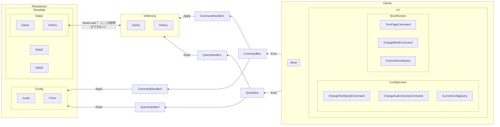
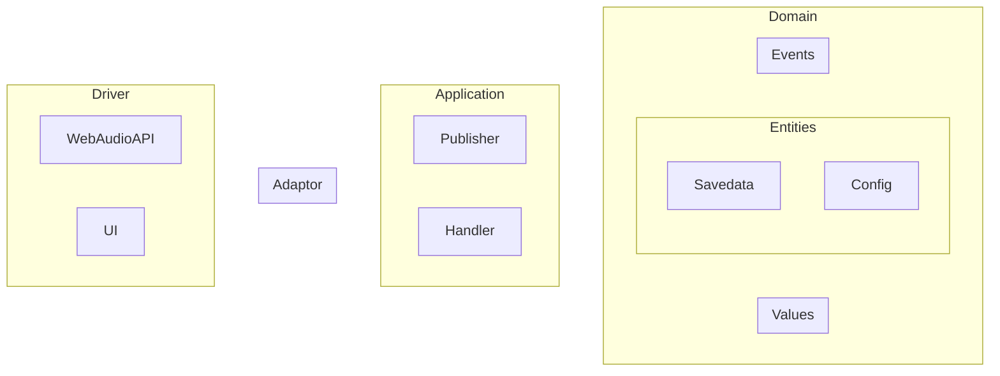

# Novel Events

- ゲームの現在の状態は、イベントの集積によって表現される
- ページをめくるという行為はイベントの外にあるべき
- ゲームのイベント外から、ゲームの状態を変化させる場合がある
  - 音量
  - テキストスピード
  - SE 再生
  - など
- ゲームを始める前から、ゲームに関する副作用がすでにある
  - BGM 再生
- UI や音声に関する設定はイベントではない
- ↓
- 現在のゲームの状態と、イベントを投げる仕組みは別
- イベントは現在のゲームの状態を変更する手段
- セーブデータごとに何のイベントが投げられたかの store を用意しておけば、過去まで遡ることが可能
  - そこから表示されているテキスト・画像、再生すべき BGM などを絞り込めば行けそう
- UI や音声管理はドライバとして提供する必要がある
  - どこからどこまでをドメインとして持つかの境界線が必要
- config は任意のオブジェクトとしてあるべき

