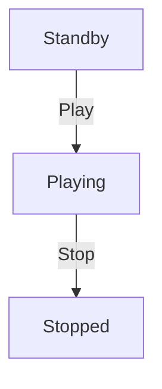

# Mixer Driver

A driver that realizes the declarative definition of Mixer using Web Audio API.

## Features

- **Declarative Audio Management**: Automatically executes complex Web Audio API processing by just defining a Mixer object
- **Differential Updates**: Compares previous state with new state and applies only necessary changes
- **In-Memory State Management**: Manages audio channel state in memory
- **Nested BusTrack Support**: Supports hierarchical audio channel structure
- **Fade In/Out**: Realizes smooth volume transitions
- **Loop Playback**: Loop playback with specified start and end positions

## Usage

### Basic Usage Example

```typescript
import { createApplyMixer, resumeAudioContext, cleanupMixer, AudioFetcher } from '@novel-game-engine-mockup/driver';
import type { Mixer } from '@novel-game-engine-mockup/engine';

// Create AudioFetcher
const fetcher = new AudioFetcher();

// Add middleware for authentication (optional)
fetcher.addMiddleware({
  beforeFetch: async (url, init) => {
    const headers = new Headers(init?.headers);
    headers.set('Authorization', 'Bearer your-token');
    
    return {
      url,
      init: {
        ...init,
        headers,
      },
    };
  },
});

// Add logging middleware (optional)
fetcher.addMiddleware({
  beforeFetch: async (url, init) => {
    console.log('Fetching audio:', url);
    return { url, init };
  },
  afterFetch: async (url, data) => {
    console.log('Fetched audio:', url, 'size:', data.byteLength);
    return data;
  },
});

// Create ApplyMixer function with fetcher
const applyMixer = createApplyMixer(fetcher);

// Define Mixer with URL instead of ArrayBuffer
const mixer: Mixer = {
  volume: 0.8,
  channels: [
    {
      id: 'bgm',
      type: 'Track',
      playStatus: 'Playing',
      volume: 1.0,
      src: '/audio/bgm.mp3', // URL instead of ArrayBuffer
      isLoop: {
        start: 0,
        end: 30,
      },
      fadeInMs: 1000,
    },
  ],
};

// Resume AudioContext after user interaction to comply with browser autoplay policy
document.addEventListener('click', async () => {
  await resumeAudioContext();
});

// Apply Mixer
await applyMixer(mixer);

// Cleanup (when application terminates)
await cleanupMixer();
```

### Hierarchical Structure with BusTrack

```typescript
const mixer: Mixer = {
  volume: 1.0,
  channels: [
    {
      id: 'music-bus',
      type: 'BusTrack',
      volume: 0.7,
      channels: [
        {
          id: 'bgm',
          type: 'Track',
          playStatus: 'Playing',
          volume: 1.0,
          src: '/audio/bgm.mp3',
        },
        {
          id: 'ambient',
          type: 'Track',
          playStatus: 'Playing',
          volume: 0.5,
          src: '/audio/ambient.mp3',
        },
      ],
    },
    {
      id: 'se-bus',
      type: 'BusTrack',
      volume: 1.0,
      channels: [
        {
          id: 'click-sound',
          type: 'Track',
          playStatus: 'Stopped',
          volume: 1.0,
          src: '/audio/click.mp3',
        },
      ],
    },
  ],
};
```

### Changing Playback State

```typescript
// Stop track (non-reusable)
const stoppedMixer: Mixer = {
  ...mixer,
  channels: mixer.channels.map((ch) =>
    ch.id === "bgm" && ch.type === "Track"
      ? { ...ch, playStatus: "Stopped" }
      : ch
  ),
};
await applyMixer(stoppedMixer);
```

## playStatus Details

The state transitions follow this flow:



- **Standby**: Ready to play. AudioBuffer is decoded but not playing. Can start playing by changing to `Playing`.
- **Playing**: Currently playing. AudioBufferSourceNode is running.
- **Stopped**: Stopped (non-reusable). AudioBufferSourceNode is stopped and playback is finished.

## API

### `createApplyMixer(fetcher: IAudioFetcher): ApplyMixer`

Creates an instance of the ApplyMixer function with injected IAudioFetcher. Uses singleton pattern internally, so multiple calls will use the same MixerDriver instance.

**Parameters**:
- `fetcher: IAudioFetcher` - Audio fetcher instance for loading audio resources

**Returns**: `ApplyMixer` - Function to apply Mixer

### `AudioFetcher`

Default implementation of `IAudioFetcher` interface that fetches audio resources from URLs.

**Methods**:
- `addMiddleware(middleware: AudioFetchMiddleware): void` - Add middleware to intercept fetch requests

### `AudioFetchMiddleware`

Interface for middleware that can intercept and transform fetch requests/responses.

**Properties**:
- `beforeFetch?: (url: string, init?: RequestInit) => Promise<{ url: string; init?: RequestInit } | null>` - Called before fetch, can modify request or cancel it
- `afterFetch?: (url: string, data: ArrayBuffer) => Promise<ArrayBuffer>` - Called after fetch, can transform response data

### `resumeAudioContext(): Promise<void>`

Resumes the AudioContext. Use this after user interaction when AudioContext needs to be resumed due to browser autoplay policy.

### `cleanupMixer(): Promise<void>`

Cleans up all audio resources and closes the AudioContext. Call this when the application terminates.

## Implementation Details

### State Management

- `MixerDriver` class manages Web Audio API nodes (GainNode, AudioBufferSourceNode, etc.)
- Maintains each channel's state (playback position, pause position, etc.) in memory
- Updates only changed channels through differential detection

### Differential Update Logic

1. Compare new Mixer with current state
2. Stop and remove deleted channels
3. Add new channels
4. Apply changes to existing channels (volume, playback state, etc.)

### Recursive Channel Addition

- `addChannel` method is called recursively to handle nested Track/BusTrack structures
- Receives parent GainNode as argument to build hierarchical structure
- Handles Track and BusTrack addition uniformly

### Fade Processing

- `fadeInMs`: Linearly increases volume from 0 to specified value at playback start
- `fadeOutMs`: Linearly decreases volume from specified value to 0 before playback end

### Loop Processing

By specifying start and end positions with the `isLoop` parameter, sets Web Audio API's `loopStart` and `loopEnd`.

## Notes

- Due to browser autoplay policy, audio may not play before user interaction. Be sure to call `resumeAudioContext()` at the appropriate timing.
- Be careful of browser resource limitations when playing many audio files simultaneously.
- Audio resources are fetched on-demand when tracks are added. Use middleware for caching if needed.
- AudioBuffer is kept in memory once decoded. Be mindful of memory usage when using many long-duration audio files.
- The `IAudioFetcher` interface allows custom implementations for different resource loading strategies (e.g., from IndexedDB, Service Worker cache, etc.).
